# Recruitment Gorilla — User Guide

Welcome! Recruitment Gorilla is the in-house applicant tracking system (ATS): recruiters upload
CVs, the system extracts candidate details, and every candidate moves through a configurable
hiring pipeline — from **Uploaded** all the way to **Recommended** — with interviews, structured
evaluations, dashboards and a full audit trail along the way.

This guide is organized **by role**. Read the *Getting started* chapter first, then jump to the
chapter for your role. Every capability of a lower role is also available to the roles above it.

## Contents

- [Chapter 0 — Getting started](#chapter-0--getting-started) *(everyone)*
- [Chapter 1 — Interviewer guide](#chapter-1--interviewer-guide)
- [Chapter 2 — Recruiter guide](#chapter-2--recruiter-guide)
- [Chapter 3 — Admin guide](#chapter-3--admin-guide)
- [Chapter 4 — SuperAdmin guide](#chapter-4--superadmin-guide)
- [Chapter 5 — Appendix](#chapter-5--appendix) *(permission matrix, pipeline map, FAQ)*

## The four roles at a glance

Roles form a strict hierarchy — each role can do everything the roles below it can:

```
SuperAdmin  →  Admin  →  Recruiter  →  Interviewer
```

| Role | In one sentence |
|---|---|
| **Interviewer** | Sees the interviews assigned to them and submits structured evaluations. |
| **Recruiter** | Owns candidates: uploads CVs, maintains profiles, and moves candidates through the pipeline for the job openings they are assigned to. |
| **Admin** | Everything a Recruiter does, on *all* candidates — plus configuration, candidate deletion, and the audit trail. |
| **SuperAdmin** | Everything — plus managing user accounts and deleting job openings. |

A user can hold **more than one role** at once; their access is the union of all of them.

> **A note on screenshots:** the screenshots in this guide were taken with demo accounts
> ("Demo Recruiter", "Ayesha Rahman" etc.). Your own screens will show your organization's
> real data, but the layout is identical.

---

# Chapter 0 — Getting started

*For everyone. This chapter covers signing in, your first login, and the parts of the app that
look the same for every role.*

## 0.1 Signing in

Open the application in your browser and you'll land on the sign-in page. Log in with your
**email address** and the password provided by your administrator.

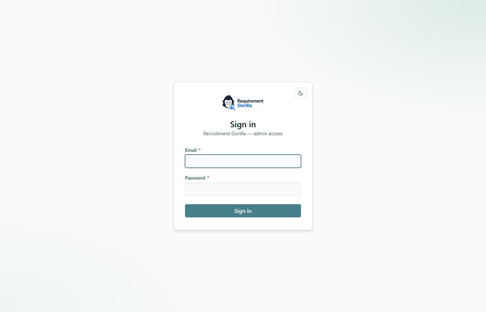

- Sessions are kept alive automatically in the background; you won't be asked to log in again
  until your session genuinely expires or you sign out.
- Use **Sign out** (top-right) on shared machines — it fully revokes your session.

## 0.2 First login — you must set a new password

Accounts are created by a SuperAdmin with a **temporary password**. The first time you sign in
(and after any admin password reset), the app takes you straight to the *Change password* screen
and will not let you go anywhere else until you set your own password:

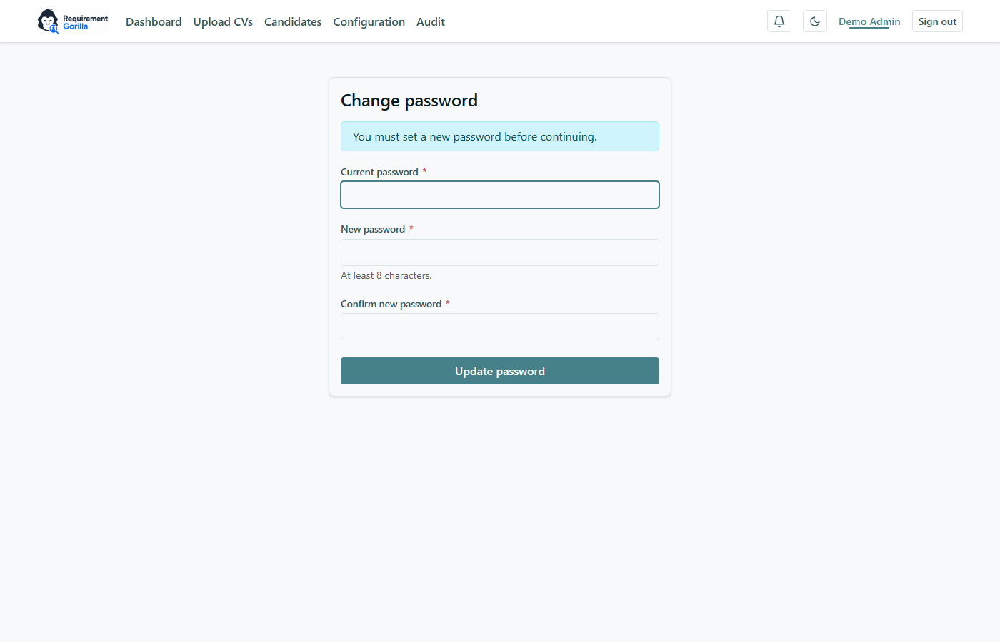

1. Enter the temporary password you were given as **Current password**.
2. Choose a new password (at least 8 characters) and confirm it.
3. Click **Update password** — you're then taken into the app.

You can change your password again at any time by clicking **your name** in the top-right corner.

## 0.3 Finding your way around

The navigation bar adapts to your role — you only see the menu items you can use:

| Menu item | Visible to |
|---|---|
| **Dashboard** | everyone |
| **Upload CVs**, **Candidates** | Recruiter and above |
| **Configuration**, **Audit** | Admin and above |
| **Users** | SuperAdmin only |

On the right side of the navbar you'll find, in order:

- **🔔 Notifications** — a bell with an unread-count badge. You get an in-app notification when
  you're assigned to an interview, when an interview is re-scheduled, and for similar events.
  Click the bell to open the list; clicking a notification takes you to the relevant page.
- **🌙 / ☀️ Theme toggle** — switches between light and dark mode. Your choice is remembered.
- **Your name** — click it to open the change-password page.
- **Sign out**.

## 0.4 The dashboard

Everyone lands on the **Dashboard** after signing in. It shows a personalized greeting with
"what needs your attention" chips, organization-wide numbers (total candidates, in process,
recommended, rejected, new this week, referred), a status breakdown, an applications trend
chart, and the **Active Job Openings** table.

What else appears depends on your role:

- **Interviewers** get a **My interviews** card listing their assigned interviews with a
  *Pending / Submitted* evaluation state.
- **Recruiters** additionally get sections scoped to *their* candidates, with a **role filter**
  to focus on one of their assigned job openings.
- **Admins / SuperAdmins** see the organization-wide view across all candidates.

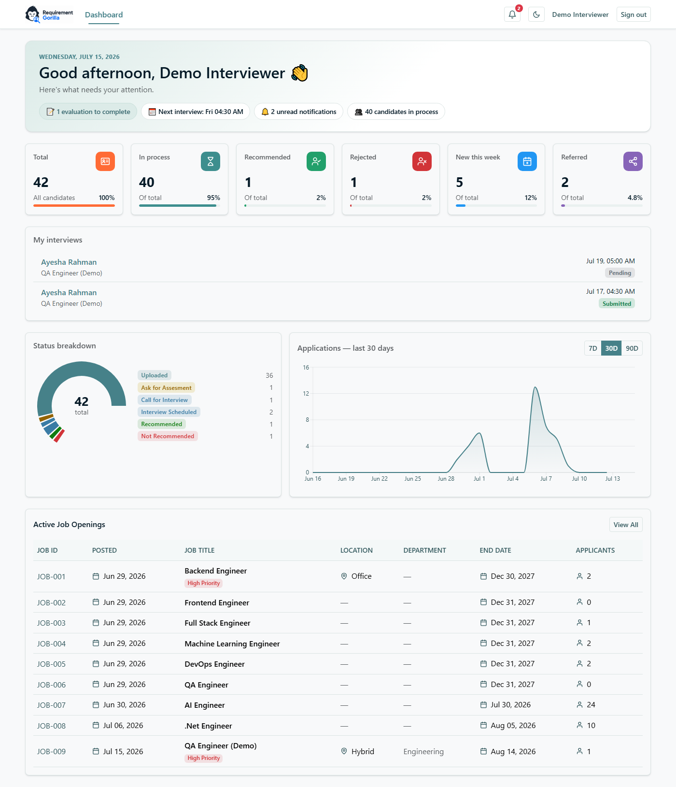

---

# Chapter 1 — Interviewer guide

*You are the evaluation specialist. Your job in the system: review the candidates assigned to
you, conduct the interview, and submit a structured evaluation. Recruiters cannot mark an
interview as completed until at least one interviewer has submitted an evaluation — so the
pipeline literally waits for you.*

## 1.1 What you can (and can't) see

As an Interviewer you see the **Dashboard** and the **interviews assigned to you** — nothing
else. You can't browse the full candidate list; instead, each assigned interview gives you a
**read-only snapshot** of exactly the candidate you're interviewing, including their CV.

## 1.2 Your interviews

Your Dashboard shows a **My interviews** card with every interview you've been assigned:


- Each row shows the candidate, the job opening, the scheduled date/time, and your evaluation
  state: **Pending** (you still need to submit) or **Submitted**.
- The greeting chips at the top tell you at a glance how many evaluations you still owe and
  when your next interview is.
- You'll also receive a **🔔 notification** whenever you're assigned to a new interview or an
  interview is re-scheduled.

Click a row to open the interview page.

## 1.3 The interview page

The interview page has everything you need in one place:

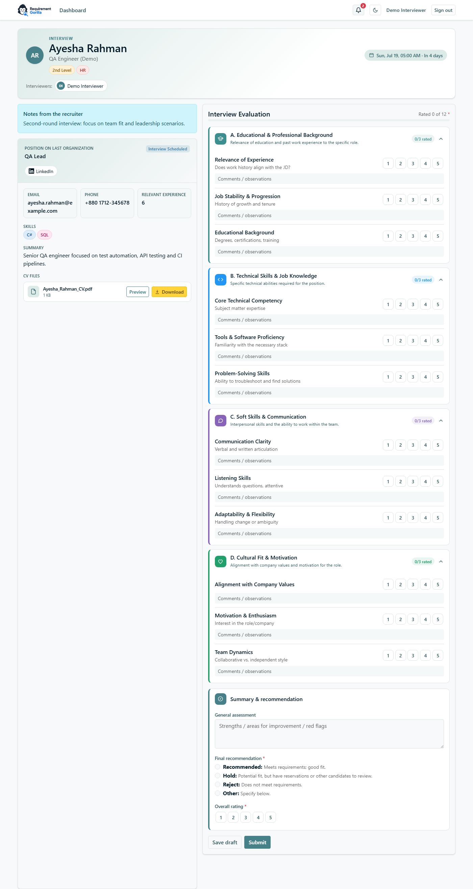

**Header** — candidate name, the job opening, the interview-type tags (e.g. *Technical*,
*HR*, *1st Level*), the scheduled time with a countdown, and the interviewer panel.

**Notes from the recruiter** (blue box) — anything the recruiter wants you to know before the
interview: focus areas, candidate preferences, context from previous rounds.

**Candidate snapshot** (left column) — current title, contact details, relevant experience,
skills, CV summary, and the CV file itself with **Preview** and **Download** buttons.

**Interview Evaluation** (right column) — the structured evaluation form, described next.

## 1.4 Filling in the evaluation

The evaluation has **12 criteria in four sections**, each rated on a **1–5** scale, each with
an optional comments box:

- **A. Educational & Professional Background** — relevance of experience, job stability &
  progression, educational background.
- **B. Technical Skills & Job Knowledge** — core technical competency, tools & software
  proficiency, problem-solving skills.
- **C. Soft Skills & Communication** — communication clarity, listening skills, adaptability &
  flexibility.
- **D. Cultural Fit & Motivation** — alignment with company values, motivation & enthusiasm,
  team dynamics.

Below the sections, the **Summary & recommendation** block asks for:

- **General assessment** — free text: strengths, areas for improvement, red flags.
- **Final recommendation** *(required)* — one of **Recommended** / **Hold** / **Reject** /
  **Other** (Other requires you to specify).
- **Overall rating** *(required)* — your single 1–5 verdict for the candidate.

## 1.5 Draft vs. Submit — the important difference

| Button | What it does |
|---|---|
| **Save draft** | Saves whatever you've entered so far — no fields are required. Come back anytime and continue. |
| **Submit** | Finalizes your evaluation. **All 12 criteria must be rated**, and a final recommendation and overall rating must be chosen. |

⚠️ **Submitting is final.** Once submitted, your evaluation is locked and can no longer be
edited — the recruiter and admins will see it exactly as submitted, and it appears in the
candidate's status history as an evaluation card. Use *Save draft* until you're sure.

---

# Chapter 2 — Recruiter guide

*You run the pipeline. As a Recruiter you upload CVs, maintain candidate profiles, and move
candidates step by step from **Uploaded** to **Recommended** — scheduling interviews and acting
on interviewer evaluations along the way.*

## 2.1 Which candidates you can see

You can access a candidate when **either** of these is true:

1. **You created them** (you are the *owner*), or
2. **You are an assigned recruiter of the candidate's job opening** — an Admin assigns
   recruiters to each job opening in Configuration. Every candidate under that opening is then
   yours to manage, *no matter who created them*, and an opening can have several recruiters
   (all of them get access).

Everything scopes to this rule: the candidate list, candidate details, CV files, editing and
status changes, and your dashboard sections.

Two limits to be aware of:

- **You cannot delete candidates** — not even your own. Deletion is Admin/SuperAdmin-only; ask
  an Admin if a record must be removed.
- **You need at least one assigned job opening (or your own candidates) to work with.** If your
  "Role applied for" dropdown is empty when creating a candidate, ask an Admin to assign you to
  an opening.

## 2.2 Your dashboard

Besides the organization-wide numbers, your dashboard has sections scoped to **your**
candidates, with a **role filter** to focus on one of your assigned job openings (or *All*):

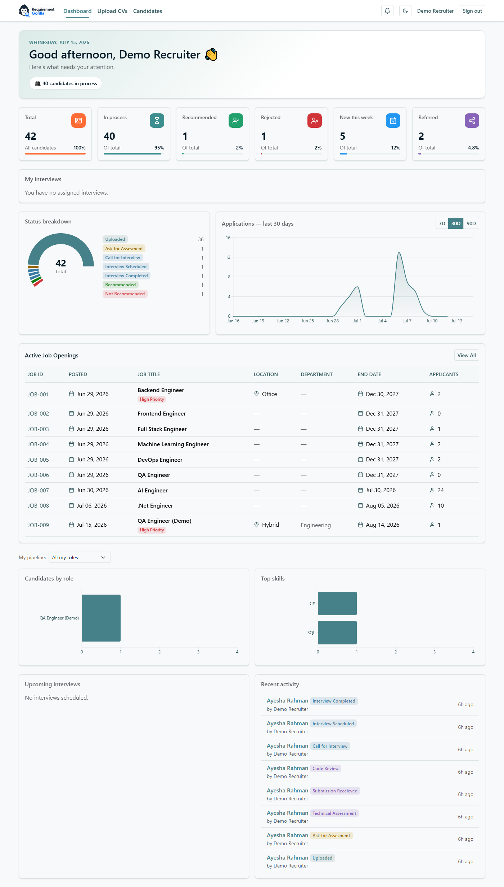

## 2.3 Adding candidates — Upload CVs

Go to **Upload CVs** (navbar or the button on the Candidates page):

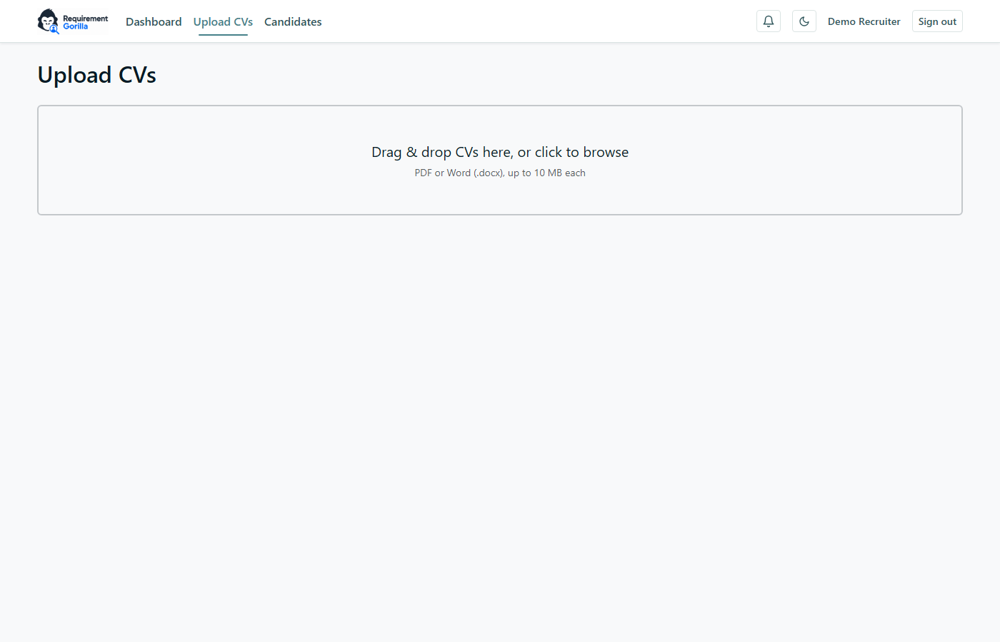

1. **Drag & drop** one or more CV files (PDF or Word `.docx`, up to 10 MB each), or click to
   browse.
2. The system **parses each CV** and pre-fills a candidate form: name, email, phone, LinkedIn,
   skills, summary. Review and correct the extracted values — parsing is a head start, not a
   guarantee.
3. Fill in the required fields (marked with a red `*`): **Full name**, **Email**,
   **Relevant experience**, and **Role applied for** — the dropdown offers only the job
   openings you're assigned to (auto-selected when you have exactly one).
4. Optionally add **skill tags**, a summary, links, and mark the candidate as **referred**
   (with the referrer's details).
5. Save — the candidate is created with the initial status **Uploaded**, and the CV file is
   attached to their profile.

If a candidate with the same email already exists you'll be warned about the duplicate before
anything is created.

## 2.4 The candidate list

**Candidates** shows every candidate you can access, with search (name or email) and a status
filter:

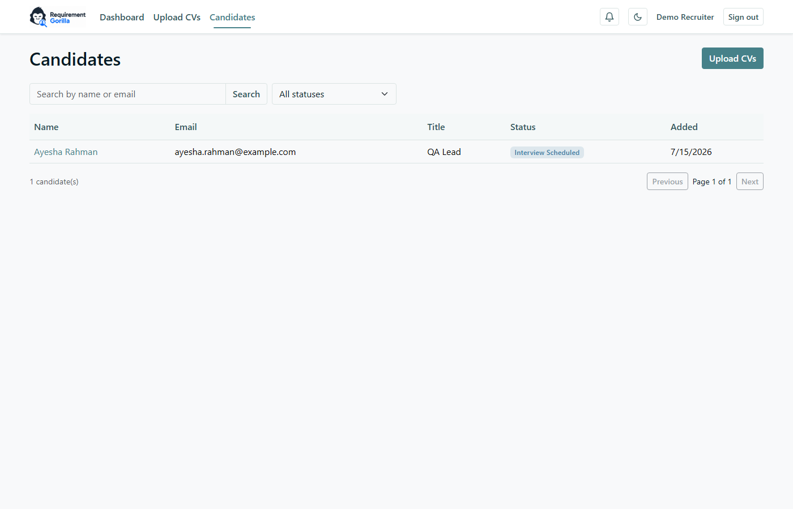

Click a name to open the candidate's detail page.

## 2.5 The candidate detail page

This is your main working screen — profile on the left, **Status history** on the right:

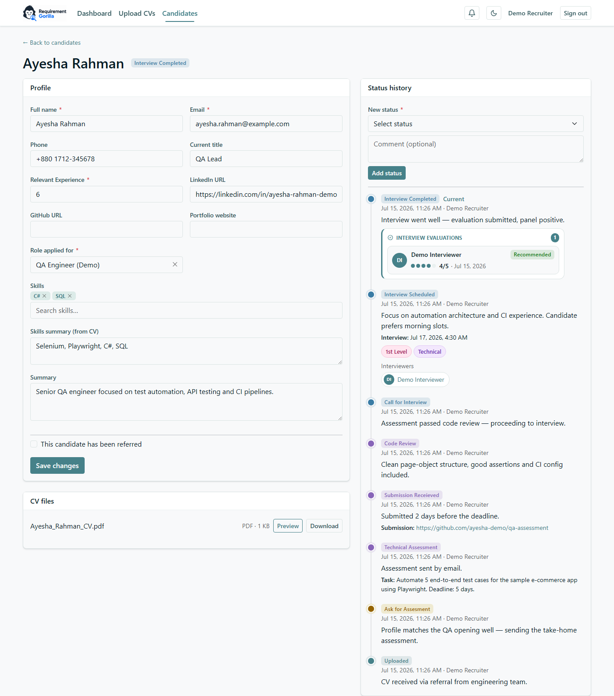

- **Profile** — edit any field and click *Save changes*. Required fields are marked `*`.
- **CV files** — **Preview** the CV in the browser or **Download** it.
- **Status history** (right) — the full journey, newest first. Each entry shows the status
  badge, when and **who** made the change, the comment, and any structured details: the
  assigned task, the submission link, interview date/time, interview-type tags, the interviewer
  panel, and — after an interview — **evaluation summary cards** (see 2.7).

> If the job opening's **End Date** has passed, the opening is locked: profile edits and status
> changes are blocked (for everyone) until an Admin extends the End Date.

## 2.6 Moving a candidate through the pipeline

At the top of the Status history panel, pick a **New status** and (optionally) add a comment,
then click **Add status**. Only the statuses that are *legal from the current status* are
offered. The main path is:

```
Uploaded → Ask for Assesment → Technical Assessment → Submission Receieved
        → Code Review → Call for Interview → Interview Scheduled
        → Interview Completed → Recommended
```

At most steps you can also branch to **Not Available**, **Reject**, **Discontinued** or
(after code review / interview) **Not Recommended**.

Some statuses require extra fields — the form asks for them automatically:

| Moving to… | You must provide |
|---|---|
| **Technical Assessment** | the **task details** the candidate must complete |
| **Submission Receieved** | the **submission URL** |
| **Interview Scheduled** | **date & time**, at least one **interviewer**, plus optional interview-type tags and notes |
| **Interview Completed** | a **comment**, and **at least one interviewer must have submitted their evaluation** |

## 2.7 Scheduling interviews

When you select **Interview Scheduled**, the form expands:

- **Interview date & time** *(required)*.
- **Interviewers** *(required, one or more)* — every assigned interviewer sees the interview on
  their dashboard and gets a 🔔 notification.
- **Interview type tags** — e.g. *Technical*, *HR*, *1st Level*, *2nd Level* (Admins maintain
  this list). The tags appear color-coded in the status tree and on the interviewer's page.
- **Comment** — this becomes the **"Notes from the recruiter"** box the interviewers see on
  their interview page. Use it for focus areas and context.

### Completing an interview

After the interview, move the candidate to **Interview Completed**. This is **gated**: at least
one assigned interviewer must have *submitted* their evaluation first. The completed entry then
shows **evaluation summary cards** — one per submitted evaluation, with the interviewer, their
recommendation and overall rating; click through to the full evaluation (Admin+ can open all
evaluations; you see the summaries).

### Re-scheduling another round

Need a second round? From **Interview Completed** you can move the candidate back to
**Interview Scheduled** — a fresh interview with its own date, panel and tags. The history
keeps both rounds, so nothing is lost:

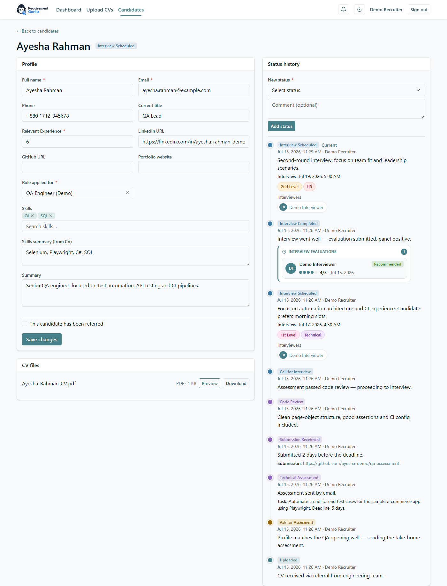

## 2.8 Closing the loop

When the panel is positive, move the candidate to **Recommended** — the end of the pipeline
(hand-off to the offer process happens outside the system today). Otherwise use
**Not Recommended**, **Reject**, **Not Available** or **Discontinued** as appropriate, with a
comment explaining why — the history is the institutional memory of the decision.

---

# Chapter 3 — Admin guide

*You keep the system running for everyone else. An Admin can do everything a Recruiter can — on
**all** candidates, not just assigned ones — plus maintain the configuration (job openings,
skills, interview types), delete candidates, and review the audit trail.*

## 3.1 What Admin adds on top of Recruiter

| Capability | Notes |
|---|---|
| See & manage **all** candidates | no ownership/assignment scoping |
| **Delete** a candidate | permanent — removes the profile, history and CV files |
| **Configuration** page | job openings, skills, interview types |
| **Audit** page | the who-changed-what-when log |
| Open **full evaluations** from a candidate's history | recruiters see only the summary cards |

Read the [Recruiter guide](#chapter-2--recruiter-guide) first — day-to-day candidate work is
identical.

## 3.2 Configuration

**Configuration** (navbar) has three sections on one page:

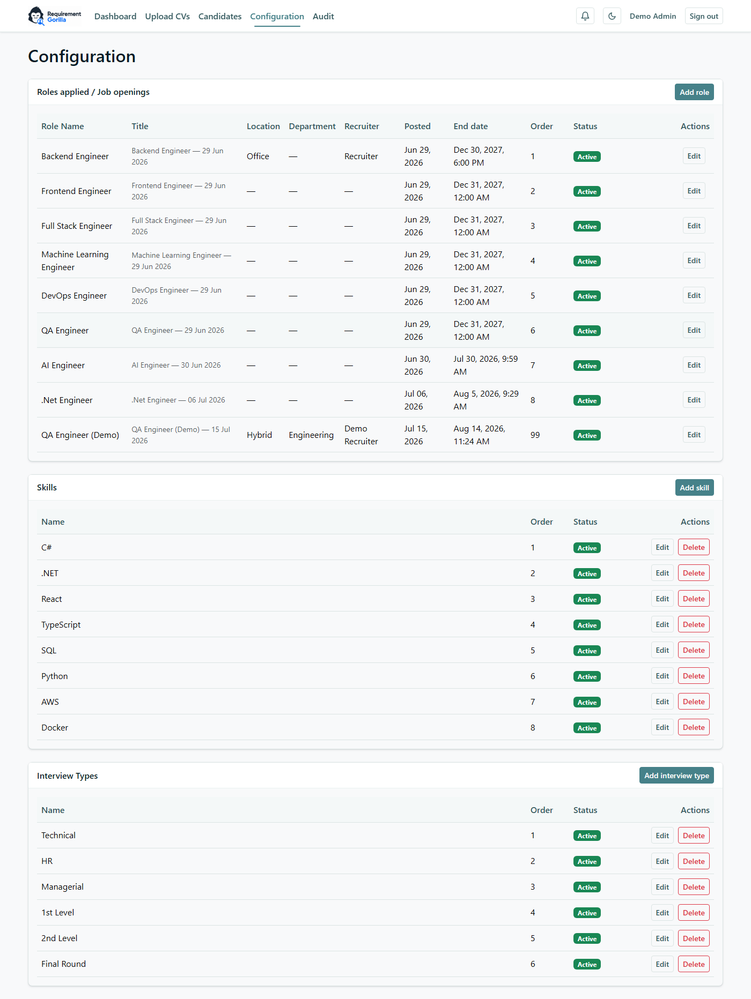

### Roles applied / Job openings

Each job opening drives a lot of behavior, so fill it in deliberately:

- **Name**, **sort order**, **active** flag — inactive openings disappear from the candidate
  form dropdown but keep their history.
- **End Date** *(required)* — after this date the opening **locks**: no profile edits or status
  changes for its candidates (for anyone) until you extend the date. Use it to freeze closed
  positions.
- **Location** (Remote / Office / Hybrid / Contractual), **Department** (Engineering / Admin /
  HR), **Priority** — shown on the dashboard's Active Job Openings table.
- **Recruiters** — assign one or more recruiters to the opening. **This is how recruiters get
  access to candidates**: an assigned recruiter can manage *every* candidate under the opening,
  regardless of who created them. Keep this list current when people change positions.

Deleting an opening is **SuperAdmin-only**; an opening that already has candidates is
soft-disabled instead of deleted (the app tells you how many candidates block it).

### Skills

The tag list offered on candidate profiles. Add, rename, deactivate. Skills already attached to
candidates survive a deactivation; a skill with no usage can be removed outright.

### Interview Types

The tags recruiters attach when scheduling interviews (*Technical*, *HR*, *1st Level*,
*2nd Level*, …). They're color-coded automatically and appear in the status tree and on the
interviewer's page. Maintain them the same way as skills.

## 3.3 Deleting a candidate

On the candidate list or detail page you (unlike recruiters) have a **Delete** button. It asks
for confirmation, then permanently removes the candidate, their status history and CV files.
The deletion itself is recorded in the audit trail — the *fact* that you deleted "Jane Doe
(#44)" remains answerable forever.

## 3.4 The audit trail

**Audit** (navbar) answers "who changed what, when" across the whole system:

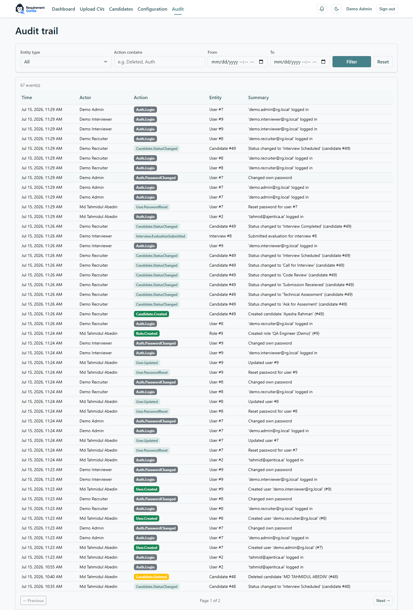

Every write is recorded: logins (including **failed** login attempts), password changes,
candidate create/update/delete and every status change, evaluation submissions, configuration
changes, and user management. Each row shows the **time**, the **actor**, a color-coded
**action** badge (e.g. `Candidate.Deleted`, `Auth.LoginFailed`), the affected **entity**, and a
human-readable summary.

Use the filter bar to narrow by **entity type**, **action** (contains-match, e.g. `Deleted`),
and a **from/to** date range; results are paginated newest-first.

Typical questions it answers:

- *Who deleted this candidate?* → Entity type **Candidate**, action `Deleted`.
- *Has anyone been trying to guess passwords?* → action `LoginFailed`.
- *What did this user change yesterday?* → date range + scan the actor column.

The log is **append-only** — nobody, including admins, can edit or remove entries.

---

# Chapter 4 — SuperAdmin guide

*You own the accounts. A SuperAdmin can do everything an Admin can, plus manage user accounts
and roles, reset passwords, and delete job openings.*

## 4.1 What SuperAdmin adds on top of Admin

| Capability | Notes |
|---|---|
| **Users** page | create users, assign roles, activate/deactivate, reset passwords |
| **Delete** a job opening | Admins can only edit/deactivate openings |

## 4.2 Managing users

**Users** (navbar) lists every account with name, email, role badges, active status, last
login, and per-row actions:

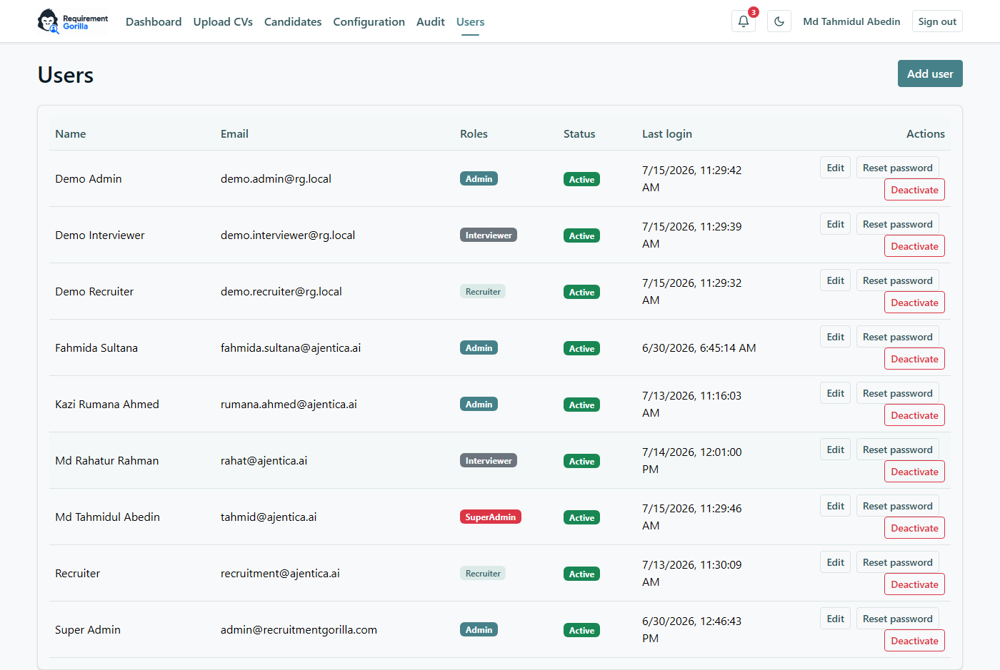

### Creating a user

Click **Add user** and provide:

- **Name** and **email** — the email is the login and must be unique.
- **Roles** — one or more of SuperAdmin / Admin / Recruiter / Interviewer. A user's access is
  the union of their roles.
- **Temporary password** — share it with the user through a secure channel. They will be
  **forced to set their own password on first login** (see
  [Getting started §0.2](#02-first-login--you-must-set-a-new-password)).

### Choosing the right role

- Someone who only conducts interviews → **Interviewer**.
- Someone who sources and manages candidates → **Recruiter** — then have an Admin **assign them
  to job openings** in Configuration, or they won't see any candidates they didn't create.
- Someone who maintains openings/skills or needs to see everything → **Admin**.
- Keep **SuperAdmin** to the smallest possible group.

### Edit / deactivate

**Edit** changes a user's name and roles. **Deactivate** blocks the account from signing in
(and from being assigned to interviews) without deleting anything — history keeps their name.
Role changes and deactivation take effect on the user's next token refresh (within minutes),
not just at next login.

> **Guard rail:** the system refuses to deactivate or strip the role of the **last active
> SuperAdmin**, so you can't lock everyone out.

### Password resets

**Reset password** sets a new temporary password (shown once — pass it on securely). The
account is flagged so the user must choose their own password at their next sign-in. The reset
is recorded in the audit trail.

## 4.3 Deleting job openings

Only SuperAdmins can delete an opening in **Configuration**. If candidates were ever filed
under it, the opening is deactivated instead of deleted and the app reports the candidate count
— history is never silently destroyed.

## 4.4 Habits that keep the system healthy

- Review the **Audit** page occasionally for `Auth.LoginFailed` bursts and unexpected
  `User.*` / `Role.*` changes.
- Deactivate accounts of people who leave — don't just let them go stale (the **Last login**
  column shows who's inactive).
- Keep each opening's **recruiter assignments** and **End Date** current — they drive both
  access and the pipeline lock.

---

# Chapter 5 — Appendix

## 5.1 Full permission matrix

| Capability | SuperAdmin | Admin | Recruiter | Interviewer |
|---|:-:|:-:|:-:|:-:|
| Dashboard | ✅ | ✅ | ✅ | ✅ |
| See assigned interviews + submit evaluations | ✅ | ✅ | ✅ | ✅ |
| View / browse candidates | all | all | own **or** assigned-opening | – (snapshot via assigned interview only) |
| Create / upload candidates | ✅ | ✅ | ✅ (becomes owner) | – |
| Edit candidate / change status | ✅ (all) | ✅ (all) | own or assigned-opening | – |
| **Delete** candidate | ✅ | ✅ | – | – |
| Open full interview evaluations from history | ✅ | ✅ | summaries only | own only |
| Configuration (openings / skills / interview types) | ✅ | ✅ | – | – |
| **Delete** a job opening | ✅ | – | – | – |
| Audit trail | ✅ | ✅ | – | – |
| Manage users & roles | ✅ | – | – | – |

## 5.2 The pipeline map

```
                                    ┌──────────────────────────────────────────┐
Uploaded ─→ Ask for Assesment ─→ Technical Assessment ─→ Submission Receieved │
                                    │        (task details*)      (submission URL*)
                                    ▼
   Code Review ─→ Call for Interview ─→ Interview Scheduled ─→ Interview Completed ─→ Recommended
        │                                (date + interviewers*)   (comment + ≥1 submitted
        ▼                                        ▲                 evaluation*)
   Not Recommended                               └──── re-schedule ─────┘

Side exits from most stages: Not Available · Reject · Discontinued
(* = required fields when entering that status)
```

## 5.3 FAQ

**I'm a Recruiter and I can't see a candidate I know exists.**
You can only see candidates you created or that belong to a job opening you're assigned to.
Ask an Admin to add you as a recruiter of that opening (Configuration → the opening → Recruiters).

**The "Role applied for" dropdown is empty when I create a candidate.**
Same cause — you have no assigned openings yet. An Admin needs to assign you to at least one.

**I can't change a candidate's status or save profile edits — everything is rejected.**
Check the job opening's **End Date**: once it passes, the opening locks for everyone. An Admin
must extend the End Date to unlock it.

**Why can't I move the candidate to "Interview Completed"?**
At least one assigned interviewer must **submit** (not just draft) their evaluation first.
Chase the panel — their dashboard shows the evaluation as *Pending*.

**The interviewer says they can't edit their evaluation anymore.**
Submitted evaluations are locked by design. If another round is genuinely needed, re-schedule
(Interview Completed → Interview Scheduled) — the new interview gets a fresh evaluation.

**I deleted a candidate by mistake. Can it be undone?**
No — deletion is permanent (that's why it's Admin-only and confirmed). The audit trail still
records who deleted what and when, but the data itself is gone.

**Why was I sent to "Change password" and can't go anywhere else?**
Your account has a temporary password (new account or admin reset). Set your own password and
the app unlocks.

**Who can see the audit trail? Is my activity in it?**
Admins and SuperAdmins. Yes — every login (including failed attempts), status change, edit,
deletion, evaluation submission and configuration change is recorded, append-only.

**Can one person be both Recruiter and Interviewer?**
Yes. Roles combine — a user holding both can manage their candidates *and* be assigned to
interview panels.

**Does the candidate get any email from the system?**
Not yet — notifications are in-app only. Communicating with candidates currently happens
outside the system.
